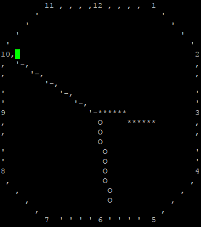
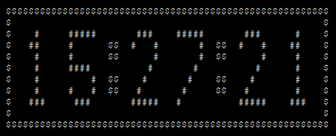

The PDP-10 was a mainframe computer popular in the 1970s.  ITS was an
operating system for the PDP-10, created by hackers at MIT.

ITS had many applications for displaying time.  Two of them were CROCK
and DCROCK.  The first displayed an analog clock on a terminal, and
the second was a digital version.  There was also a CLOCK which worked
with the Knight TV raster display.

I think it would be an appropriate tribute to the PDP-10 and a nod to
the ITS hacker culture to make a wall-mounted CROCK using a PDP-10
emulator running on a small board connected to a flat screen.

